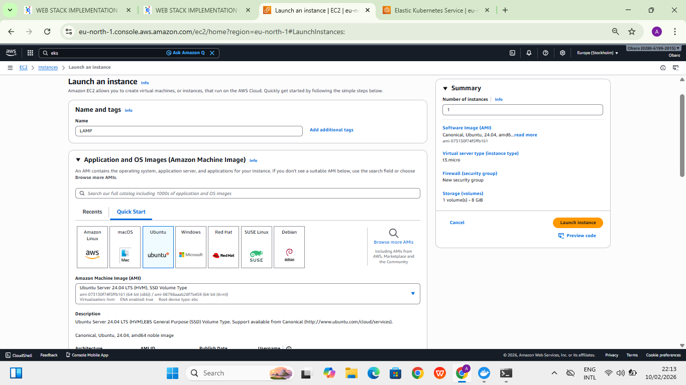
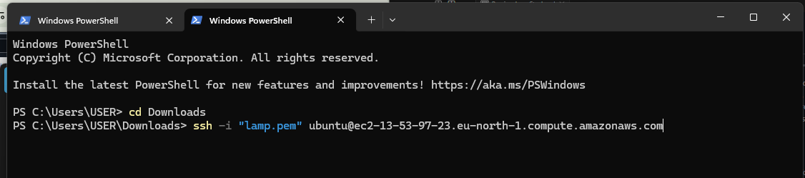
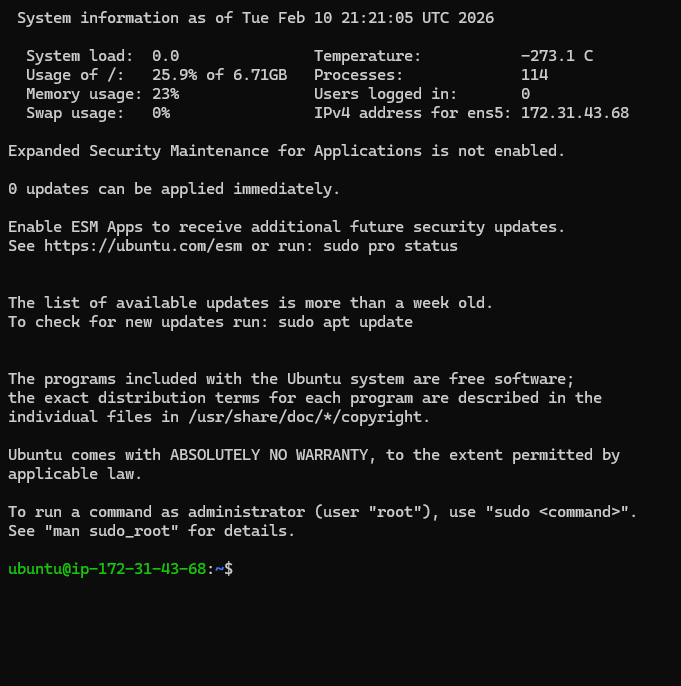
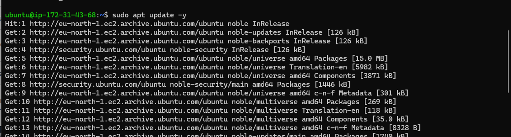
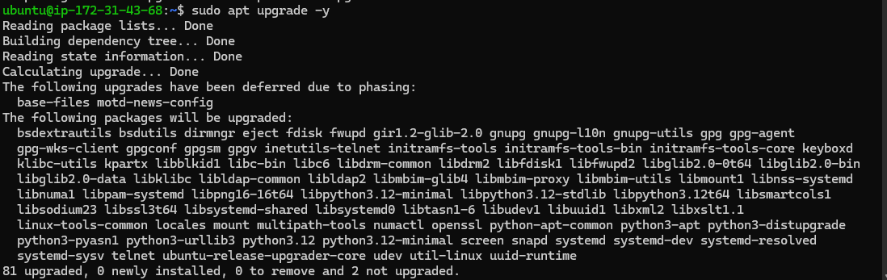
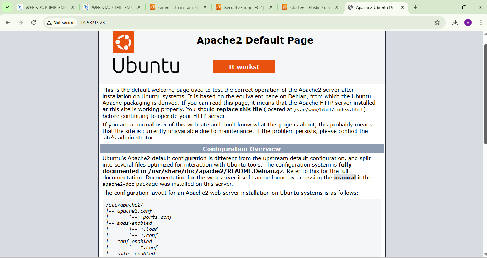
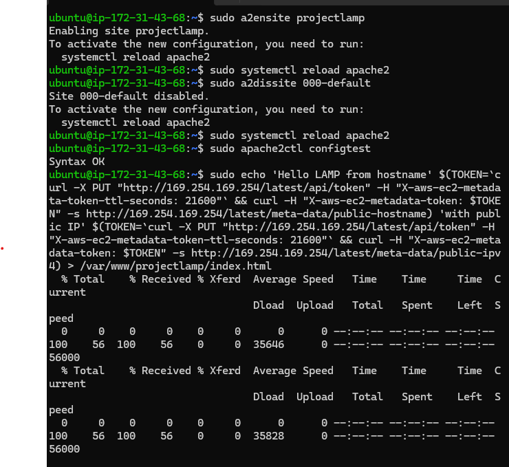

 #              THE LAMP PROJECT VIA EC2 IN AWS
___
>******This project demonstrates the deployment and configuration of a LAMP stack (**Linux, Apache, MySQL, PHP**) on AWS infrastructure. It covers server provisioning, web server setup, database configuration, and application deployment in a cloud environment. The goal is to provide a practical, hands-on implementation of hosting dynamic web applications on AWS using industry-standard tools.******


1.   ###    PROVISION EC2
> Manually provisioned and configured an AWS EC2 instance as the base infrastructure for the LAMP stack deploymeNT 
 
 
  **CONNECTION via SSH to EC2 VIA TERMINAL**

  **I navigate to Downloads because my .pem is located there**
```
cd Downloads
ssh -i "lamp.pem" ubuntu@ec2-13-53-97-23.eu-north-1.compute.amazonaws.com
   ````

**THE EC2 LOGIN**

 
Then I updated and upgraded because it is AMI
```
sudo apt update && sudo apt upgrade
```



2. ###  APACHE2 INSTALLATION AND SETUP
   
   **install and confirm apache is runinng**
 ```
 sudo apt install apache2
 sudo systemctl status apache2
 ```
 
 

   ***Accessed it locally within the ubuntu server/ the terminal in ubuntu using***

```
curl http://localhost.com
```


***since I see this page, my web server is now correctly installed and accessible through firewall.***



3. ### THE MYSQL INSTALLATION AND LOGIN CONFIGURATION
 I need to install a Database Management System (DBMS) to be able to store and manage data for this site in a relational database. MySQL is a popular relational database management system used within PHP environment.

I install mysql using:

```

sudo apt install mysql-server -y

```
logged in to the MySQL console, connected to the MySQL server as the administrative database user root, which is inferred by the use of sudo when running this command.
````
sudo mysql 
````
then password changed
````
ALTER USER 'root'@'localhost' IDENTIFIED WITH myqsl_native_password BY 'PassWord.1';

exit
````


I then logged in to Start the interactive script


test if I can log in to the MySQL console. The -p flag in this command, which will prompt for the password used after changing the root user password.
````
sudo mysql -p 

exit
````


### THE PHP
I have Apache installed to serve my web content and MySQL installed to store and manage my application data. To complete the LAMP stack, I installed PHP so my server can process code and display dynamic content to users.

Along with the main php package, I installed php-mysql, which allows PHP to communicate with MySQL databases. I also installed libapache2-mod-php to enable Apache to properly handle and execute PHP files. The required core PHP packages were automatically installed as dependencies during the setup process.

````
sudo apt install php libapache2-mod-php php-mysql
````

Once the installation was completed, I ran the following command to confirm that PHP was successfully installed and to verify the version running on my server:
````
php -v
````

5. CREATING A VIRTUAL HOST FOR WEBSITE USING APACHE
In this project, I set up a domain called projectlamp, although it can be replaced with any domain of choice.

By default, Apache on Ubuntu 20.04 comes with one server block enabled, configured to serve documents from the /var/www/html directory. I left the default configuration unchanged and created my own project directory alongside the default one to host the projectlamp website.
```
sudo mkdir /var/www/projectlamp

sudo chown -R $USER:$USER /var/www/projectlamp

```
Next, I assigned ownership of the project directory using the `$USER` environment variable, which references my current system user. This ensured I had the proper permissions to manage and modify files within the directory.

Then, I created and opened a new configuration file in Apache’s **sites-available** directory using my preferred command-line editor. In this case, I used **vi (vim)** to create and edit the new virtual host configuration file for my project.
```
sudo vi /etc/apache2/sites-available/projectlamp.conf
```


**I then used the **`a2ensite`** command to enable the new virtual host configuration I created for my project, allowing Apache to recognize and serve the new site.**
```
sudo a2ensite projectlamp

```
**After enabling my new virtual host, I disabled the default website that comes pre-installed with Apache to prevent any conflicts and ensure my **projectlamp** configuration is the one being served.**
 . disable 
 . syntax error check
 . then reload
````
sudo a2dissite 000-default
sudo apache2ctl configtest
sudo systemctl reload apache2
````

After enabling the new Apache virtual host, the document root directory /var/www/projectlamp was still empty. To verify that the virtual host was correctly configured and active, I created a test index.html file inside the directory.
````
sudo echo 'Hello LAMP from hostname' $(TOKEN=`curl -X PUT "http://169.254.169.254/latest/api/token" -H "X-aws-ec2-metadata-token-ttl-seconds: 21600"` && curl -H "X-aws-ec2-metadata-token: $TOKEN" -s http://169.254.169.254/latest/meta-data/public-hostname) 'with public IP' $(TOKEN=`curl -X PUT "http://169.254.169.254/latest/api/token" -H "X-aws-ec2-metadata-token-ttl-seconds: 21600"` && curl -H "X-aws-ec2-metadata-token: $TOKEN" -s http://169.254.169.254/latest/meta-data/public-ipv4) > /var/www/projectlamp/index.html


````

Now, test the website on web browser
````
publicIp:80 

13.53.97.23:80

````
***then to WEB browser to confirm further using***:
```
PUBLIC IP :80
```
 
### ENABLING PHP ON THE WEBSITE
By default, Apache prioritizes index.html over index.php because of the DirectoryIndex configuration. This means that if both files exist in the same directory, index.html will be served first.

This behavior is useful for maintenance purposes. For example, you can temporarily create an index.html file with a maintenance message. Since it takes precedence, visitors will see the maintenance page instead of the main index.php application. Once maintenance is complete, simply remove or rename index.html to restore normal application access.

If you want index.php to take priority instead, edit the configuration file:
````
sudo vim /etc/apache2/mods-enabled/dir.conf

````
````
<IfModule mod_dir.c>
        #Change this:
        #DirectoryIndex index.html index.cgi index.pl index.php index.xhtml index.htm
        #To this:
        DirectoryIndex index.php index.html index.cgi index.pl index.xhtml index.htm
</IfModule>
````

then APACHE RELOAD
````
sudo systemctl reload apache2
````
To confirm that PHP is correctly installed and properly integrated with Apache, I created a PHP test file inside the custom web root directory /var/www/projectlamp.
````
vim /var/www/projectlamp/index.php
````
then paste
````
<?php
phpinfo();
````

then close and save, reload the web page


